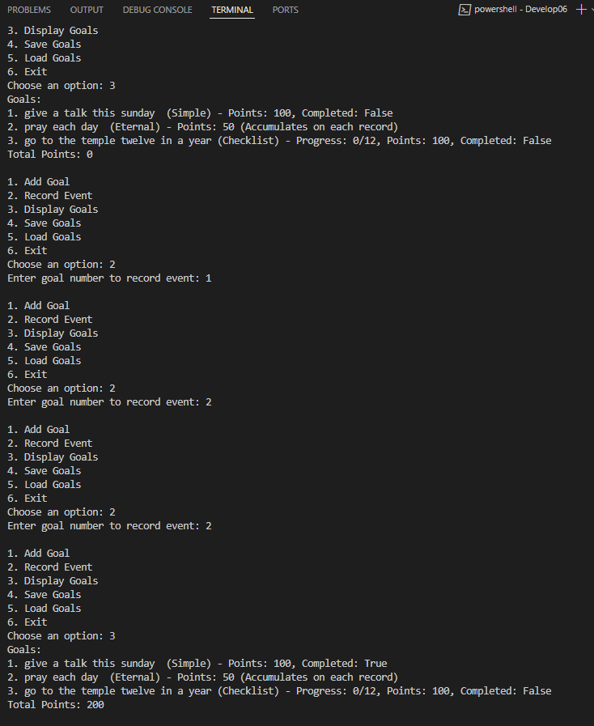

While executing the 4th option I had the next problem to save the file, it's an Exception because i have Windows 11 but I tried in another computer and it works

Unhandled exception. System.UnauthorizedAccessException: Access to the path 'D:\BYU IDAHO\CSE210-ProgrammingWithClasses\cse210-hw\prove\Develop06\goals.txt' is denied.
   at System.IO.RandomAccess.WriteAtOffset(SafeFileHandle handle, ReadOnlySpan`1 buffer, Int64 fileOffset)
   at System.IO.Strategies.OSFileStreamStrategy.Write(ReadOnlySpan`1 buffer)
   at System.IO.Strategies.OSFileStreamStrategy.Write(Byte[] buffer, Int32 offset, Int32 count)
   at System.IO.Strategies.BufferedFileStreamStrategy.Flush(Boolean flushToDisk)
   at System.IO.StreamWriter.Flush(Boolean flushStream, Boolean flushEncoder)
   at System.IO.StreamWriter.Dispose(Boolean disposing)
   at System.IO.TextWriter.Dispose()
   at GoalManager.SaveGoals(String filename) in D:\BYU IDAHO\CSE210-ProgrammingWithClasses\cse210-hw\prove\Develop06\GoalManager.cs:line 98
   at Program.Main(String[] args) in D:\BYU IDAHO\CSE210-ProgrammingWithClasses\cse210-hw\prove\Develop06\Program.cs:line 38

   if someone has a quickly solution please let me know....